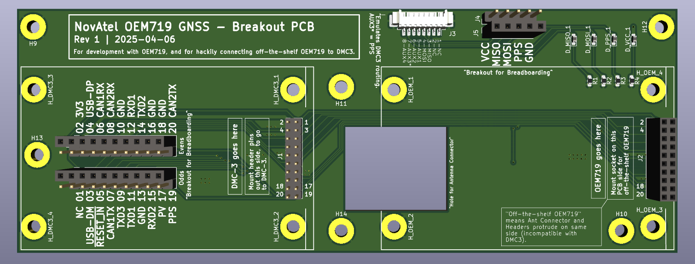
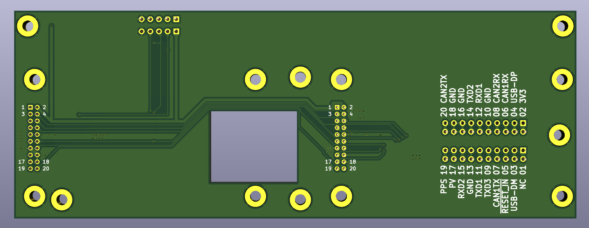

# OEM719-GNSS-Breakout-PCB
PCB to breakout the NovAtel OEM719 GNSS receiver PCB for development and testing

## Description

This PCB serves the following purposes:

* Adapts the NovAtel OEM719 GNSS receiver PCB to a standard 2.54mm pitch header.
    * The default off-the-shelf NovAtel OEM719 PCB has a 2.0mm pitch header, which is difficult for prototyping and development.
* Adapts the NovAtel OEM719 GNSS receiver PCB, without pin modifications, to the DMC3 board configuration
    * The DMC3 board requires that the NovAtel OEM719 PCB be mounted upside down, which requires a custom PCB to adapt the pinout.

## References

* Documentation for the OEM719 is [available publicly on the NovAtel website](https://docs.novatel.com/OEM7/Content/Technical_Specs_Receiver/OEM719_Specifications.htma).
    * [OEM719 Pin Specifications](https://docs.novatel.com/OEM7/Content/Technical_Specs_Receiver/OEM719_Interface_Connector.htm)
    * [OEM719 Mechanical Drawings](https://docs.novatel.com/OEM7/Content/Technical_Specs_Receiver/OEM719_Mechanicals.htm)

## PCB Render

